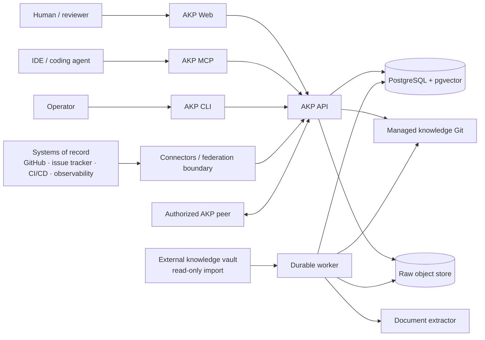

# C4 architecture views

## System context

Humans and agents enter through different adapters but reach the same authorization, revision, truth and governance rules. External systems remain authoritative for their own objects; connector or federated content enters as scoped context, never as an automatic trust upgrade.

## Containers and responsibilities

| Container  | Responsibility                                                                        | Must not own                                |
| ---------- | ------------------------------------------------------------------------------------- | ------------------------------------------- |
| API        | Auth, RBAC, use-case orchestration, search/context, review/governance endpoints       | extraction or direct unreviewed publication |
| Worker     | Durable state machine, immutable object transfer, compilation plan and draft creation | approval decisions                          |
| Extractor  | Deterministic text/PDF/HTML/image derivative generation                               | domain authority or publication             |
| Web        | Human workspace, review, graph, work and operator surfaces                            | authorization decisions                     |
| MCP/CLI    | Thin agent/operator adapters over the same use cases                                  | separate business logic                     |
| PostgreSQL | Runtime state, relations, indexes, audit and eval history                             | canonical raw bytes                         |
| MinIO      | Content-addressed raw bytes                                                           | mutable filenames as identity               |
| Git        | Approved managed Markdown and review history                                          | job/cache state                             |

## Trust boundaries

External files and project paths cross an allowlisted boundary. Extracted content is untrusted until compilation validation and review. Tokens are authenticated by hash and permissions are evaluated before retrieval expansion. Workspace membership, graph adjacency, connector reachability and context revision pins are not authorization grants. See [threat-model.md](../security/threat-model.md).
