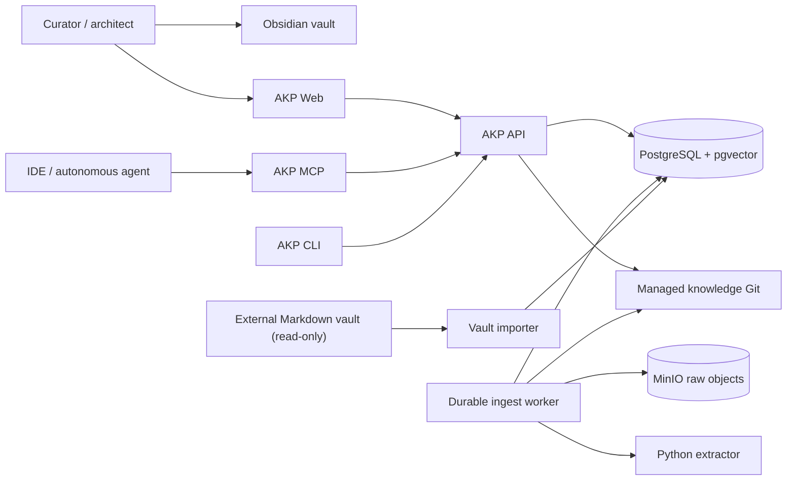

# C4 architecture views

## System context

The original vault remains the human corpus imported read-only. The managed Git repository contains reviewed supplemental knowledge. PostgreSQL, embeddings and packets are projections, never the only copy of knowledge.

## Containers and responsibilities

| Container  | Responsibility                                                                        | Must not own                                |
| ---------- | ------------------------------------------------------------------------------------- | ------------------------------------------- |
| API        | Auth, RBAC, use-case orchestration, search/context, review/governance endpoints       | extraction or direct unreviewed publication |
| Worker     | Durable state machine, immutable object transfer, compilation plan and draft creation | approval decisions                          |
| Extractor  | Deterministic text/PDF/HTML/image derivative generation                               | domain authority or publication             |
| Web        | Human operational views and review actions                                            | authorization decisions                     |
| MCP/CLI    | Thin agent/operator adapters over the same use cases                                  | separate business logic                     |
| PostgreSQL | Runtime state, relations, indexes, audit and eval history                             | canonical raw bytes                         |
| MinIO      | Content-addressed raw bytes                                                           | mutable filenames as identity               |
| Git        | Approved managed Markdown and review history                                          | job/cache state                             |

## Trust boundaries

External files and project paths cross an allowlisted boundary. Extracted content is untrusted until compilation validation and review. Tokens are authenticated by hash and permissions are evaluated within one membership/space pair. See [threat-model.md](../security/threat-model.md).
