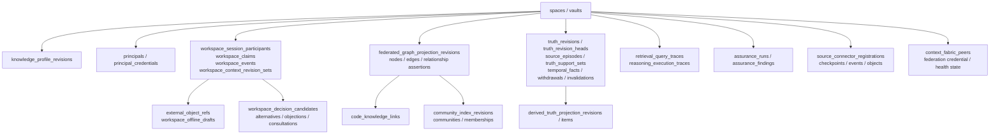

# Database ERD

```mermaid
erDiagram
  ORGANIZATIONS ||--o{ SPACES : owns
  USERS ||--o{ MEMBERSHIPS : receives
  USERS ||--o{ API_TOKENS : issues
  USERS ||--o{ WEB_SESSIONS : opens
  USERS ||--o{ IDEMPOTENCY_RECORDS : claims
  SPACES ||--o{ MEMBERSHIPS : scopes
  SPACES ||--o{ VAULTS : imports
  VAULTS ||--o{ VAULT_IMPORT_RUNS : records
  VAULT_IMPORT_RUNS ||--o{ VAULT_IMPORT_ISSUES : reports
  SPACES ||--o{ KNOWLEDGE_DOCUMENTS : contains
  KNOWLEDGE_DOCUMENTS ||--o{ KNOWLEDGE_VERSIONS : versions
  KNOWLEDGE_DOCUMENTS ||--o{ KNOWLEDGE_UNITS : decomposes
  KNOWLEDGE_UNITS ||--o{ UNIT_EMBEDDINGS : projects
  KNOWLEDGE_DOCUMENTS ||--o{ KNOWLEDGE_RELATIONS : originates
  KNOWLEDGE_DOCUMENTS ||--o{ KNOWLEDGE_RELATIONS : targets
  SPACES ||--o{ SOURCES : registers
  SOURCES ||--o{ SOURCE_ARTIFACTS : derives
  SOURCES ||--o{ EVIDENCE : locates
  EVIDENCE ||--o{ DOCUMENT_EVIDENCE : supports
  KNOWLEDGE_DOCUMENTS ||--o{ DOCUMENT_EVIDENCE : cites
  SPACES ||--o{ INGEST_JOBS : queues
  INGEST_JOBS ||--o{ INGEST_JOB_EVENTS : audits
  SPACES ||--o{ REVIEWS : governs
  REVIEWS ||--o{ REVIEW_COMMENTS : discusses
  SPACES ||--|| INDEX_REVISIONS : projects
  SPACES ||--o{ CONTEXT_PACKETS : emits
  SPACES ||--o{ CONTRADICTION_CLUSTERS : tracks
  CONTRADICTION_CLUSTERS ||--o{ CONTRADICTION_MEMBERS : groups
  KNOWLEDGE_DOCUMENTS ||--o{ CONTRADICTION_MEMBERS : disputes
  SPACES ||--o{ EVAL_RUNS : measures
  SPACES ||--o{ KNOWLEDGE_LINT_RUNS : audits
  SPACES ||--o{ SCHEMA_DRY_RUNS : assesses
  SPACES ||--o{ PROJECTS : inventories
  SPACES ||--o{ ERROR_BOOK : learns
  SPACES ||--o{ AUDIT_EVENTS : records
  SPACES ||--o| PUBLICATION_LOCKS : serializes

  API_TOKENS {
    uuid id PK
    uuid user_id FK
    jsonb scopes
    timestamptz expires_at
    timestamptz revoked_at
  }
  WEB_SESSIONS {
    uuid id PK
    uuid user_id FK
    jsonb scopes
    timestamptz expires_at
    timestamptz revoked_at
  }
  IDEMPOTENCY_RECORDS {
    uuid actor_id FK
    text credential_fingerprint PK
    text operation PK
    text idempotency_key PK
    text state
  }
  PUBLICATION_LOCKS {
    uuid space_id PK
    text owner
    timestamptz expires_at
  }
  REPOSITORY_PUBLICATION_LOCKS {
    text repository_key PK
    text owner
    timestamptz expires_at
  }
```

## v0.4 durable-state domains

The core ERD above shows the original authority/runtime backbone. v0.4 adds durable workspace, profile, graph, temporal, assurance, connector and federation state through append-only migrations. This conceptual map names the main table families; migration SQL remains authoritative for columns and constraints.

These records remain split by responsibility: workspace state is not canonical knowledge; graph/community/retrieval state is derived or operational; truth/support records preserve temporal and evidence semantics rather than rewriting approved Git history.

`API_TOKENS.scopes` and `WEB_SESSIONS.scopes` contain a `TokenScopeSet` JSON
object (`spaces[]` with `spaceId`, `pathPrefix` and `permissions`). A null
`pathPrefix` denotes whole-space access; a relative path is narrower. Session
scope snapshots are intersected with current memberships at request time.

`IDEMPOTENCY_RECORDS` is partitioned by `(actor_id, credential_fingerprint,
operation, idempotency_key)` so retries cannot cross credentials or effective
authorization snapshots. `PUBLICATION_LOCKS` is the legacy space lock kept for
auditability; publication and rollback use the repository-keyed
`REPOSITORY_PUBLICATION_LOCKS` table.

Migrations are append-only and recorded with SHA-256. The runner holds a PostgreSQL advisory lock so two migration processes cannot race. This diagram is conceptual; migration SQL is authoritative.
