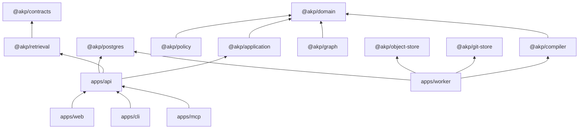

# Module and dependency model

The platform is a modular monolith with adapters around deterministic cores.

`dependency-cruiser.cjs` is the executable boundary gate. Shared packages contain technical primitives only. The Python extractor implements an external protocol and does not duplicate the domain model.

Primary modules map to identity, sources, ingestion, knowledge, review, retrieval, governance, evaluation and integration. They are currently deployed together; splitting them into microservices is not a goal.

## Federated graph substrate

The federated graph substrate keeps graph semantics separated by domain rather than merging every relation into one universal namespace. A graph node is identified by domain, scope, kind, canonical key and revision. Projection revisions are stored in PostgreSQL with their source revision/hash, provider/configuration version, lifecycle and freshness; the active revision is a pointer, not a rewrite of historical nodes or edges.

`PostgresFederatedGraphStore` implements the common projection/query boundary used for `build`, incremental `update`, `neighbors`, `paths` and `impact`. Cross-domain bridges are explicit edges and retain derivation plus source/evidence/locator provenance. Traversal applies relation, direction, hop, fanout, candidate and time bounds, prevents cycles, and filters seeds, intermediate nodes, edges and targets against the supplied authorization scope. A hidden intermediate therefore cannot act as an invisible transit node.

Fresh projections are the default. A stale active projection is excluded under `FRESH_ONLY`; callers must opt into `ALLOW_STALE`, and returned nodes continue to carry their projection revision and stale label. The PostgreSQL adapter intentionally remains structurally compatible with `@akp/contracts` without importing contract source into its package `rootDir`; canonical contract validation stays at public/application boundaries and integration tests.
