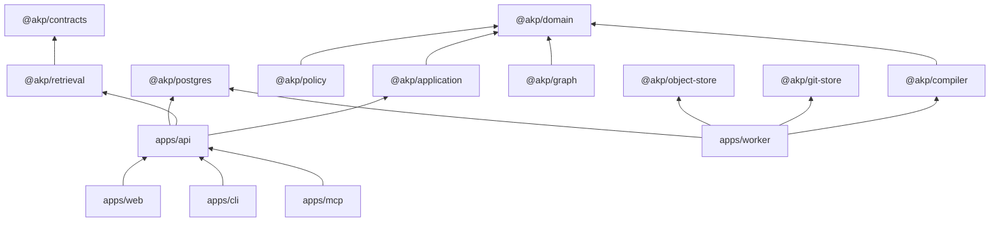

# Module and dependency model

The platform is a modular monolith with adapters around deterministic cores.

`dependency-cruiser.cjs` is the executable boundary gate. Shared packages contain technical primitives only. The Python extractor implements an external protocol and does not duplicate the domain model.

Primary modules map to identity, sources, ingestion, knowledge, review, retrieval, governance, evaluation and integration. They are currently deployed together; splitting them into microservices is not a goal.
