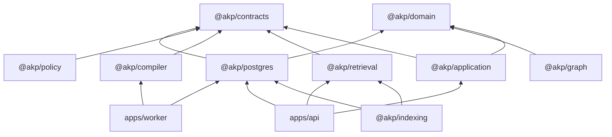

# Module and dependency model

AKP is a modular monolith: the **module dependency graph** is distinct from the **runtime request graph**. See [repository standards](repository-standards.md) and [core-product redesign roadmap](core-redesign-roadmap.md) for rules and known debt.

```mermaid
flowchart BT
  Application["@akp/application"] --> Contracts["@akp/contracts"]
  Application --> Domain["@akp/domain"]
  Retrieval["@akp/retrieval"] --> Contracts
  Compiler["@akp/compiler"] --> Contracts
  Policy["@akp/policy"] --> Contracts
  Graph["@akp/graph"] --> Domain
  Postgres["@akp/postgres"] --> Domain
  Postgres --> Contracts
  Indexing["@akp/indexing"] --> Retrieval
  Indexing --> Postgres
  API["apps/api"] --> Application
  API --> Retrieval
  API --> Postgres
  Worker["apps/worker"] --> Compiler
  Worker --> Postgres
```

The diagram is a **selected subset** of actual import dependencies, not a complete ownership or execution map. The MCP runtime communicates with the API via HTTP while importing application/contracts modules locally. The CLI currently imports PostgreSQL and vault-importer directly for operational tasks; its status as a "thin API client" is a **known architectural mismatch** to be migrated rather than hidden in diagrams. The Web communicates with the API over HTTP.

`dependency-cruiser.cjs` checks source imports; `scripts/validate-module-boundaries.mjs` checks declared internal package graph, cycles, missing packages and pure-module restrictions. Both are called by `pnpm boundaries`. Package checks cannot independently prove source-level business ownership.

A Python extractor is an external document-intelligence boundary; it must not duplicate publication authority. Splitting the monolith into extra microservices is not a design goal.

## Federated graph substrate

The federated graph substrate keeps graph semantics separated by domain rather than merging every relation into one universal namespace. A graph node is identified by domain, scope, kind, canonical key and revision. Projection revisions are stored in PostgreSQL with their source revision/hash, provider/configuration version, lifecycle and freshness; the active revision is a pointer, not a rewrite of historical nodes or edges.

`PostgresFederatedGraphStore` implements the common projection/query boundary used for `build`, incremental `update`, `neighbors`, `paths` and `impact`. Cross-domain bridges are explicit edges and retain derivation plus source/evidence/locator provenance. Traversal applies relation, direction, hop, fanout, candidate and time bounds, prevents cycles, and filters seeds, intermediate nodes, edges and targets against the supplied authorization scope. A hidden intermediate therefore cannot act as an invisible transit node.

Fresh projections are the default. A stale active projection is excluded under `FRESH_ONLY`; callers must opt into `ALLOW_STALE`, and returned nodes continue to carry their projection revision and stale label. The PostgreSQL adapter intentionally remains structurally compatible with `@akp/contracts` without importing contract source into its package `rootDir`; canonical contract validation stays at public/application boundaries and integration tests.
