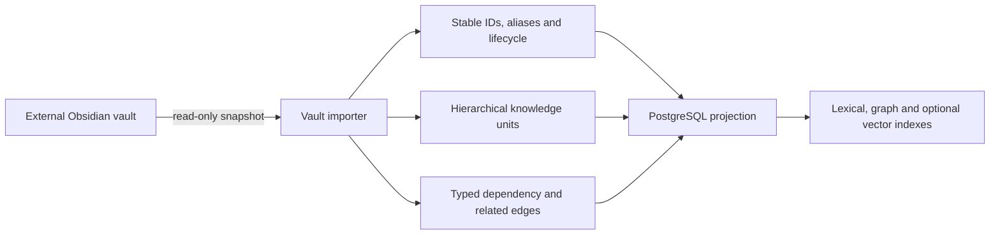
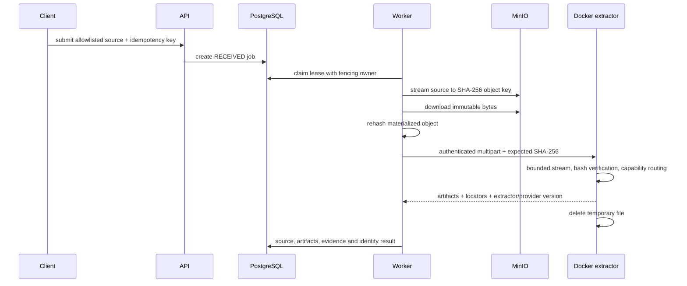
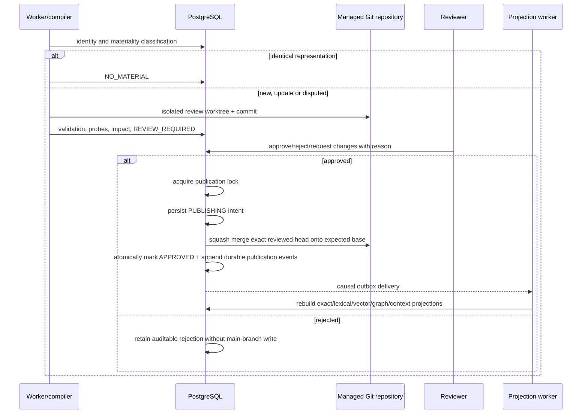
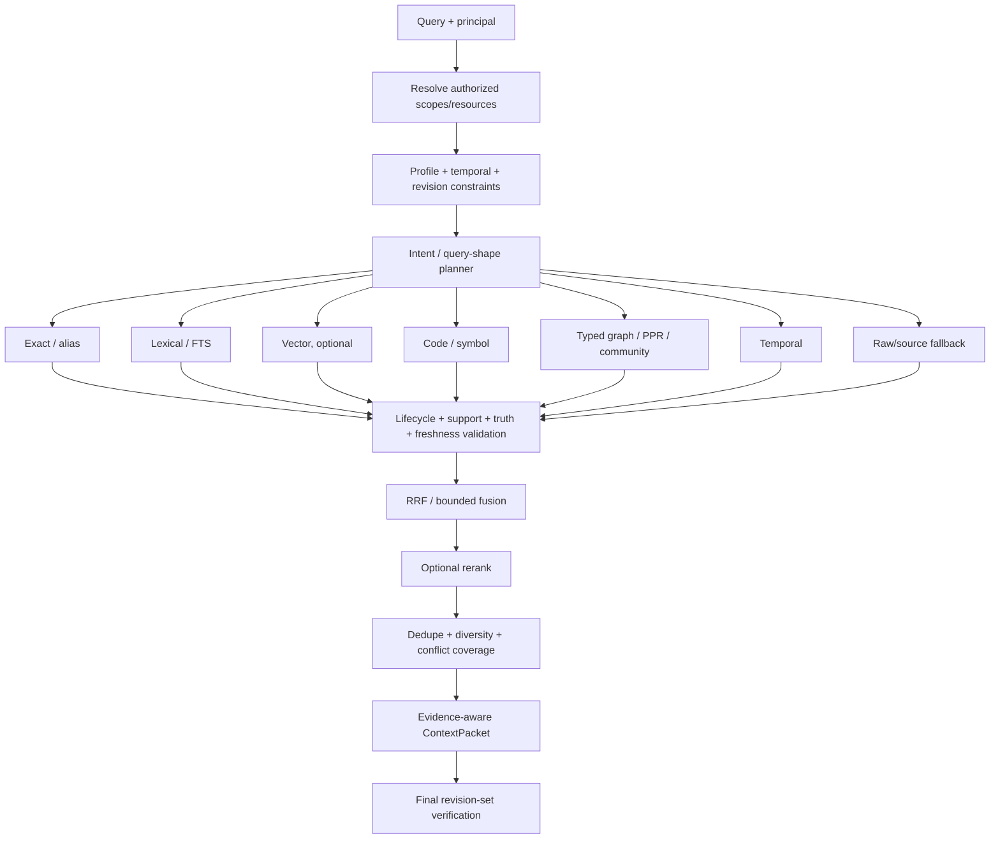
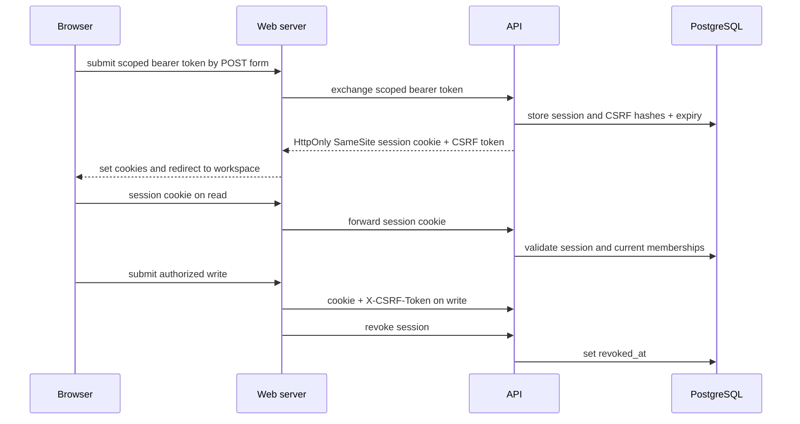
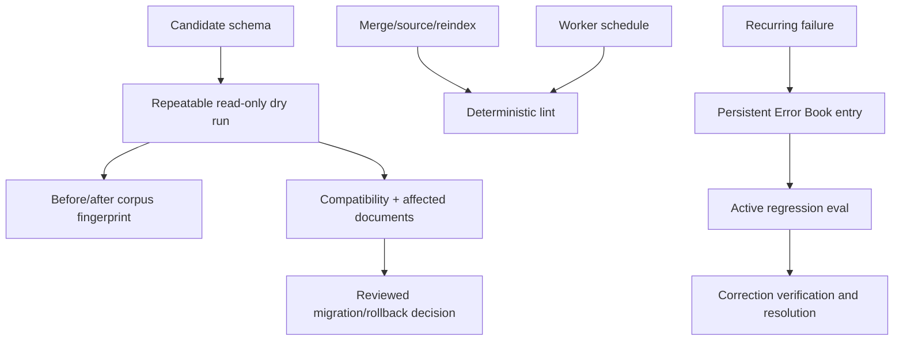
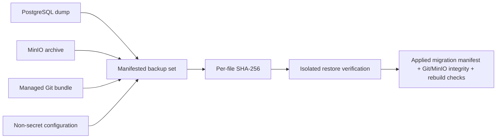

# Runtime flows

## Read-only vault import



The importer never writes indexes, runtime state or corrected metadata back to
the vault. Curated recovery maps remain operational knowledge. Copied
acquisition/download manifests are preserved as archived raw provenance and do
not enter normal agent retrieval.

## Immutable source ingestion and extraction



Hash mismatch fails with `IMMUTABLE_OBJECT_HASH_MISMATCH`. DOCX paragraphs and
tables and PPTX slides/notes carry source-hash locators. OCR-capable routes
produce page and region provenance when the selected local/provider capability
is configured; an unavailable explicitly requested capability fails closed with
`CAPABILITY_NOT_CONFIGURED` rather than fabricating an artifact. Audio/video
transcription is optional and requires an administrator-configured transcription
endpoint; video demux additionally requires local ffmpeg. Visual captioning is
reported separately and is never implied by transcription. Long stages renew
their lease. Another worker can reclaim the job only after lease expiry.

## Compilation, review and publication



Canonical publication and projection maintenance are deliberately separated.
After the reviewed Git commit succeeds, the API finalizes the review and appends
`KnowledgePublished`, `CorpusRevisionPublished` and the projection requests in
one PostgreSQL transaction. Lexical, vector, graph and ContextPacket state is
then rebuilt asynchronously by the durable outbox worker; an ordinary
projection failure is retried, quarantined or reconciled and does not revert
canonical Git.

If Git moved but database finalization fails, publication compensation attempts
a Git revert before returning the review to `CHANGES_REQUESTED`. If that state
cannot be attributed or compensated safely, the review moves to
`PUBLICATION_RECOVERY_REQUIRED` and requires explicit reconciliation. A crash
after the Git commit and before database finalization is recovered only when the
current main commit can be matched exactly to the durable `PUBLISHING` intent;
otherwise reconciliation fails closed.

Rollback is itself a new canonical publication. The managed repository creates
a Git revert commit and the database appends a new `CorpusRevisionPublished`
root event plus the same projection invalidation/update fanout, so derived state
converges to the rollback revision through the normal durable lifecycle.

## Retrieval and ContextPacket



Authorization constrains candidate generation before graph/vector/community expansion. Truth-valid retrieval rejects stale or unsupported derived candidates before they can displace valid candidates during fusion or reranking. Optional channels may degrade independently, but they cannot resurrect candidates rejected by authorization, lifecycle, temporal or support policy.

## Workspace coordination and promotion

```text
┌────────────┐   ┌────────────┐   ┌────────────┐   ┌────────────────┐
│ READ       │ → │ WORK       │ → │ VERIFY     │ → │ CAPTURE/HANDOFF│
│ bootstrap  │   │ code/tools │   │ support    │   │ durable state  │
└────────────┘   └────────────┘   └────────────┘   └───────┬────────┘
                                                              │
                                                    durable knowledge?
                                                              │
                                                              ▼
┌────────────┐   ┌────────────┐   ┌────────────┐   ┌────────────┐
│ EVOLVE     │ ← │ PUBLISH    │ ← │ REVIEW     │ ← │ PROMOTE    │
│ next read  │   │ Git+events │   │ human/policy│  │ candidate  │
└────────────┘   └────────────┘   └────────────┘   └────────────┘
```

Work claims and handoffs are durable coordination state. Promotion creates a governed review candidate; only the existing review/publication path can produce approved managed-Git knowledge.

## Browser authentication



## Schema governance, lint and Error Book



Dry-run never applies a migration. Lint findings are durable reports. Error
Book resolution requires a recorded verification result.

## Backup and isolated restore


